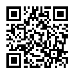

# GlowAvatar

*[Русская версия](README.ru.md)*

A small tool for preparing avatars/logos that "glow" brighter than plain
white on HDR screens (iPhone/iPad, MacBook, Windows HDR monitors) — the same
trick people are now using for LinkedIn.

Verified live: on a real HDR laptop, in a Chromium browser (Brave), the
exported logo genuinely glows brighter than the surrounding UI.

## Download and run

**No Python required** — grab a build from the [Releases](../../releases/latest)
page:
- **Windows** — `GlowAvatar-windows.exe`. SmartScreen will warn about an
  unsigned exe ("Windows protected your PC") — that's expected, click
  **"More info" → "Run anyway"**.
- **macOS** — `GlowAvatar-macos.zip`, containing `GlowAvatar.app`. Gatekeeper
  will also complain about an unsigned app on first launch — open it via
  **right-click the icon → "Open" → "Open"** (a plain double-click won't
  work the first time).

Both builds are produced automatically on every release via GitHub Actions
(`.github/workflows/build-release.yml`) — Windows and macOS runners, so the
macOS build doesn't need a local Mac.

**From source (Windows/macOS/Linux, needs Python 3.10+):**
```
pip install -r requirements.txt
python glow_avatar_gui.py
```
On Windows you can just double-click `run.bat`.

## How it works

LinkedIn (and most social networks) strips HDR metadata (gain map, MPF/XMP)
on upload, but keeps the embedded ICC color profile. So the HDR data is
hidden inside the color profile: pixels are encoded through a
"Rec2020 Gamut with PQ Transfer" profile (Rec.2020 gamut + the PQ / SMPTE
ST 2084 quantizer, plus ICC v4 `cicp`+`lumi` tags, without which Chromium
won't actually grant the image real HDR headroom). Color-managed browsers on
an HDR screen then interpret those pixels not as "100% white" but as an
absolute luminance in nits — hence the glow. On a regular SDR screen the same
photo just looks like a normal, clean photo.

The app builds the ICC profile itself, locally (see `icc_profile.py`) and
does all the color math (`colorimetry.py`, `glow_core.py`) — no third-party
`.icc` files and no internet needed at runtime.

## Usage

1. **"Open photo…"** — pick a square or any photo (it gets center-cropped
   to a square automatically).
2. Paint the glow mask:
   - **Brush** — a soft brush (adjustable "edge softness"); overlapping
     strokes don't stack into overexposure.
   - **Eraser** — reduces the mask.
   - **Gradient (linear/radial)** — drag with the mouse for a smooth
     transition (e.g. a glow ring around an avatar's outline).
   - **Magic wand (by color)** — click a color (e.g. the orange in a logo)
     to select the *connected* region of similar color ("color tolerance"
     controls how similar; connected means only the blob touching your
     click, not every similar pixel in the whole image).
   - **"Build mask from brightness"** — an auto-suggestion based on
     bright/white pixels.
   - The mask isn't binary — values are smooth 0..1, so gradients are
     supported natively.
3. **"Target glow brightness"** — an exposure-stops slider (+2 stops ≈
   800 nits by default, up to ≈ 4000 nits). A saturated color physically
   can't glow as bright as white (HDR panels have lower peak brightness for
   pure color) — for a stronger, more honest effect there's **"Whiten at
   peak"** (0 = off, brightness only).
4. **Output size** — any size in px (square).
5. **"Export…"** — saves a Progressive JPEG with the Rec2020-PQ ICC profile
   embedded. Ready to upload to LinkedIn.

## Important

- **The glow won't be visible on a regular monitor** — the in-app preview
  only shows slightly brightened mask zones (for editing convenience), not
  the real HDR effect. Check it on a device with an HDR screen with HDR
  turned on. **A screenshot won't show the glow either** — most screen
  capture tools grab the already SDR-composited picture; look at the actual
  screen with your eyes.
- The effect depends on the viewer's screen and browser; on SDR screens and
  in browsers without color management the photo just looks like a normal,
  clean photo.
- Never re-save the exported file in another editor/converter — that usually
  strips the embedded ICC profile along with the effect.
- Social networks can start stripping/re-encoding ICC profiles at any time —
  this isn't guaranteed to work forever.

## Support

If this was useful, you can buy me a coffee: **[Boosty](https://boosty.to/cynicplay)**



## License

MIT, see [LICENSE](LICENSE).
